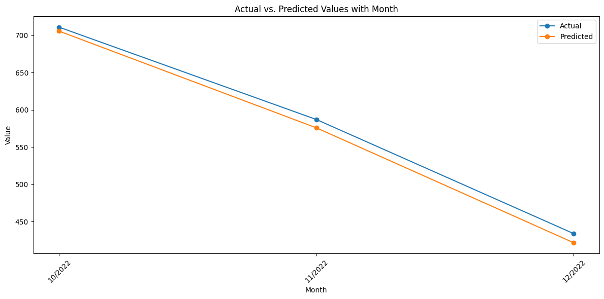

# Rice-Export-Forecasting
Developed a Deep Learning techniques on historical data to forecast Vietnam’s rice export volumes using Long Short-Term Memory (LSTM). Implemented a Recurrent Neural Network (RNN) to capture non-linear temporal dependencies between economic indicators and environmental factors , improving planning accuracy for production cycles.

Tech Stack

- Language: Python 3.x
- Deep Learning: TensorFlow, Keras
- Data Analysis: Pandas, NumPy, Scikit-learn
- Visualization: Matplotlib, Seaborn
- Environment: Google Colab

Model Architecture

The core of this project is a Recurrent Neural Network (RNN) using LSTM layers.
- Data Windowing: Implemented a 24-month sliding window to capture long-term seasonal trends.
- Preprocessing: Used MinMaxScaler for feature normalization and LabelEncoder for categorical variables (like wind direction or region).
- Optimization: Integrated Dropout (20%) and EarlyStopping to prevent overfitting and ensure the model generalizes well to new data.

Requirement libraries:
- numpy
- pandas
- seaborn
- matplotlib
- scikit-learn
- tensorflow

Project Performance
The model shows a very strong correlation between actual and predicted export volumes, capturing the downward trend across the final quarter of 2022.

This chart demonstrates the LSTM model's ability to generalize and predict seasonal shifts with high accuracy.